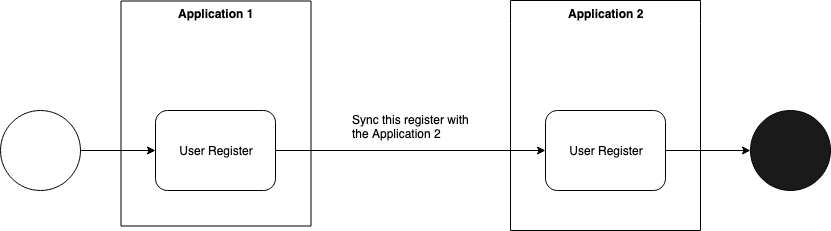

# Real Time Facade Example

(this feature is available since Laravel 5.5)

I always wonder why difficult situations happens often with legacy code. but that might be something inherent for programming: the code is an expression of how the problem was, and how you saw the solution at a given time. If it happens for you to visualize differently something, you would have solved it in a different way.

Trying to solve such problems, people create principles. Principles, originally, would be a set of rules to solve issues that you can't foresee. So you create these rules to avoid problems that you might have at some point. For sure we have problems that happens to be unsolvable for a given moment later in the project, but some rules blindly followed are simply a bigger problem.

Well, I just wanted to say that: always question. I'm not a fan of TDD, but as far as I can see, it helps in the majority of my designs, maybe because I don't like to make my architecture too rigid too soon, but I question it usefulness for codes that I can't even conceive without prototyping and seeing how it works first, and some circumstances at some critical projects can't wait for the prototype to be refactored.

At this episode, I'll share a case that happened with me, when I needed to test an application without refactoring existent services that were not created with tests in mind. Let's dig it...

## Implementation

### Files

- Tests: https://github.com/PHP-Kanata/laravel-sample/blob/test-case-sample-real-time-facade/tests/Feature/UserTest.php
- Controller: https://github.com/PHP-Kanata/laravel-sample/blob/test-case-sample-real-time-facade/app/Http/Controllers/UserController.php
- Service: https://github.com/PHP-Kanata/laravel-sample/blob/test-case-sample-real-time-facade/app/Services/UserSyncService.php

### Big Picture

This example consists in a system that makes a request through a service to another application, and that request must be mocked in order for the automated tests to not make that request during the tests.

This is the process:



At the user test file, we have 2 tests, the first test (`testUserWithSync`), the code will actually do the request to the Application 2. At the second test (`testUserWithoutSyncRealTimeStrategy`) the application won't make the request to the second application, and that happens because of the Real Time Facade. That is implemented by adding the namespace `\Facades\` before the service that has to be mocked namespace, like this: `use \Facades\App\Services\UserSyncService;`.

Once that is done, we can mock using this at the test (that is actually added to the second test):

(https://github.com/PHP-Kanata/laravel-sample/blob/test-case-sample-real-time-facade/tests/Feature/UserTest.php#L35)
```php
$user = factory(User::class)->make([
    'name' => $name,
]);
UserSyncService::shouldReceive('sync')->andReturn($user);
```

This is proxying the call to the Mockery class. You can find more about Mockery library here: http://docs.mockery.io/en/latest/
This library is useful when you need to replace specific functionalities of services, then you "mock" the actual instance, and control what specific method calls does.

This is not finished yet, in order to make the Real Time Facade to work, we also need to add this to the controller, and this can be found here:

https://github.com/PHP-Kanata/laravel-sample/blob/test-case-sample-real-time-facade/app/Http/Controllers/UserController.php#L13
```php
use \Facades\App\Services\UserSyncService;
```

And here:

https://github.com/PHP-Kanata/laravel-sample/blob/test-case-sample-real-time-facade/app/Http/Controllers/UserController.php#L45
```php
$userSynced = UserSyncService::sync($userSample);
```

The Facade added before the namespace of the service makes any static call to that service done like in the line 45 to be proxied to an actual instance of that service in the background.


With this implementation, you can run the test with the confidence that the call to the method `UserSyncService::sync` won't trigger anything:

```shell
vendor/bin/phpunit --filter UserTest
```


